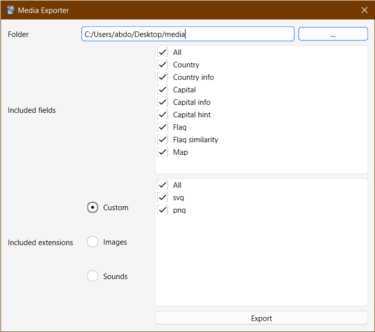

Anki add-on that allows you to export media files from a chosen deck or note to a folder.

The add-on can be accessed from different locations:

-   From the "Export Media" menu item under the gears icon besides each deck's name in the main screen.
-   From a button in the editor toolbar.
-   From the _Notes > Export Media_ browser menu item to export from selected notes.

## Download

You can download the add-on from its AnkiWeb page: https://ankiweb.net/shared/info/567329012

## Credit

The editor icon is adapted from [Bootstrap Icons](https://icons.getbootstrap.com/).

## Changelog

See [CHANGELOG.md](CHANGELOG.md) for a list of changes.

## Support & feature requests

Please post any questions, bug reports, or feature requests in the [support page](https://forums.ankiweb.net/t/media-exporter-add-on/20693) or the [issue tracker](https://github.com/abdnh/anki-media-exporter/issues).

If you want priority support for your feature/help request, I'm available for hire.
You can get in touch from the aforementioned pages, via [email](mailto:abdo@abdnh.net) or on [Fiverr](https://www.fiverr.com/abd_nh).

## Support me

Consider supporting me if you like my work:

I'm also available for freelance add-on development:

